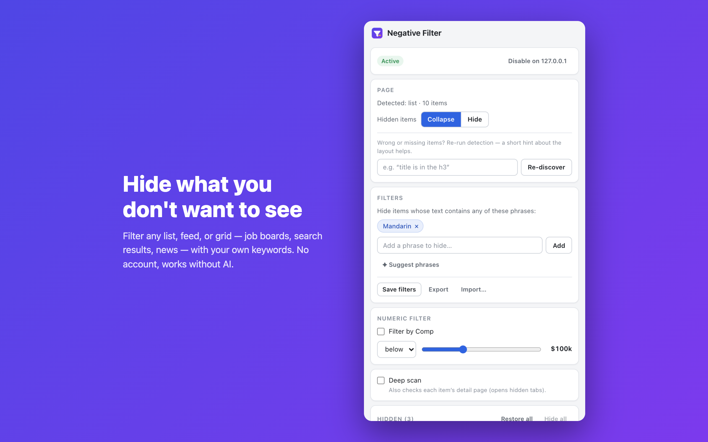

<p align="center">
  
</p>

<h1 align="center">Negative Filter</h1>

<p align="center">
  <strong>Hide what you don't want to see.</strong><br>
  Filter any list, feed, or grid — job boards, search results, news — with your own keywords.
</p>

<p align="center">
  
</p>

---

Every feed shows you things you've already decided you don't care about: the same
irrelevant job postings, the same topics, the same stories. Negative Filter lets you
say what you **don't** want, once, and keeps it out of view everywhere on that site —
across pagination, infinite scroll, and revisits.

## How it works

1. **Open the side panel** — click the Negative Filter icon in your toolbar.
2. **Enable the site** — one click grants the extension access to that site only.
   Nothing runs anywhere you haven't enabled.
3. **Add phrases to hide** — e.g. `crypto`, `staffing agency`, `clickbait`. Items
   whose text matches collapse into a slim one-line bar.
4. **Restore anything with one click** — hidden items are listed in the panel and
   inline on the page; nothing is deleted, only hidden.

Your filters are saved per site layout and re-apply automatically the next time you
visit. The toolbar badge shows how many items are hidden on the current tab.

## Features

- **Works on any site with repeating items** — lists, carousels, and grids are
  detected automatically. Built-in support for LinkedIn Jobs (both layouts).
- **Keyword & phrase filters** — match against an item's full visible text.
- **Numeric filters** — e.g. hide jobs with compensation below a threshold.
- **Deep scan** (optional) — also check each item's detail page, so a phrase buried
  in a job description still triggers the filter.
- **Saved filter sets** — per site layout, synced via your Chrome profile, with
  JSON export / import.
- **Survives modern pages** — infinite scroll, virtualized lists, and single-page
  navigation don't shake it off.

## Privacy

Negative Filter is private by design:

- **No account. No tracking. No analytics.** Nothing is sent to the developer, ever.
- **Per-site opt-in.** The extension only runs on origins you explicitly enable.
- **Keyword filtering is fully local** — it works offline, with no API key.
- **Optional AI features** (named-field detection, phrase suggestions) use **your
  own** Anthropic or OpenAI API key. Only a redacted, content-free skeleton of the
  page structure is sent — never page text, URLs, or anything personal. A built-in
  spend cap limits calls per day and per month.

Full details: [PRIVACY.md](PRIVACY.md).

## Install

**From the Chrome Web Store** — _(link coming after review)_.

**From source:**

```bash
git clone https://github.com/birjoossh/sieve.git
cd sieve
npm install
npm run build
```

Then open `chrome://extensions`, enable **Developer mode**, click **Load unpacked**,
and select the `dist/` folder.

## FAQ

**Do I need an AI key?**
No. Keyword and phrase filtering — the core of the extension — is fully local. An
API key only unlocks two extras: automatic detection of named fields (like
"company" or "compensation") on unfamiliar layouts, and phrase suggestions.

**Is anything deleted from the page?**
No. Hidden items collapse to a one-line bar (or can be hidden entirely — your
choice). Click the bar, or use the panel's Hidden list, to bring anything back.

**Why does it ask for permission per site?**
The extension ships with access to nothing. When you click Enable on a site, Chrome
grants it access to that origin only. You can revoke it at any time from the panel
or from `chrome://extensions`.

**A site's layout changed and filtering broke. What do I do?**
Click **Re-discover** in the panel, optionally with a short hint (e.g. "title is in
the h3"). If you've added an API key it will re-learn the layout; otherwise it falls
back to local detection.

## Development

```bash
npm run typecheck   # tsc --noEmit
npm run watch       # esbuild, rebuild on change
npm run test        # full Playwright suite
npm run package     # build + zip for the Web Store → out/
```

See [BUILD_PLAN.md](BUILD_PLAN.md) for the module map and [DESIGN.md](DESIGN.md) for
the numbered design decisions.

## License

Open source — see the repository for details. Issues and PRs welcome at
<https://github.com/birjoossh/sieve/issues>.
